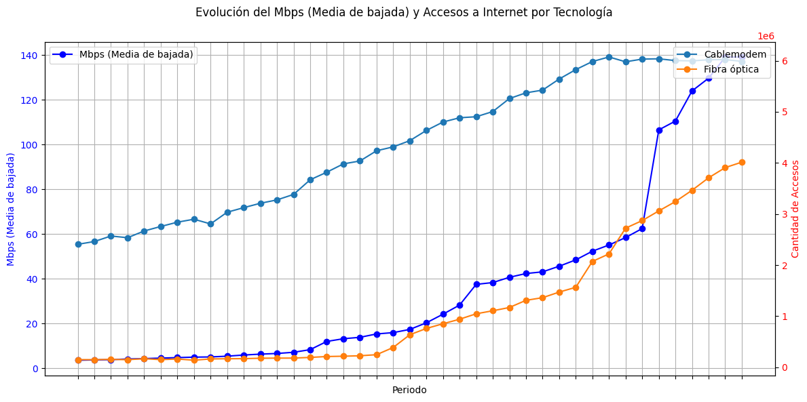
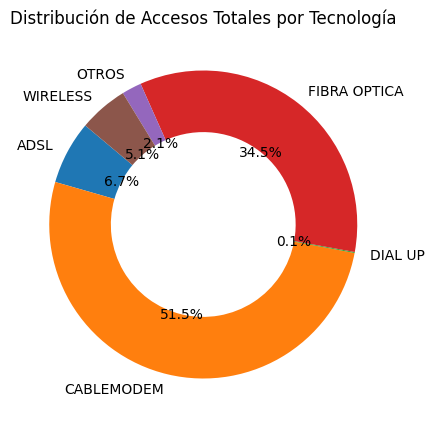
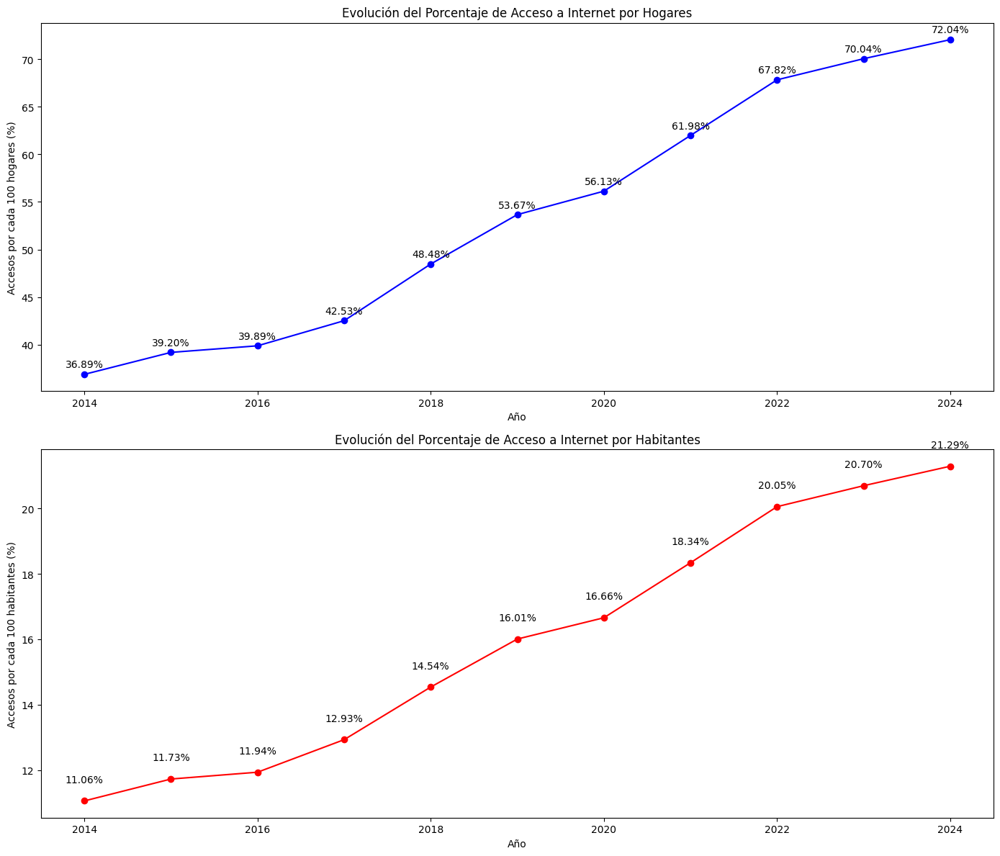

# Proyecto Individual N° 2  - Data Analytics: Telecomunicaciones

En este proyecto ejerceré el rol de Data Analyst, a los efectos de realizar un análisis completo para conocer el comportamiento del Sector de Telecomunicaciones en Argentina, a lo largo de todo el país. Se hará principalmente foco en los accesos al servicio de Internet, pero sin dejar de analizar el comportamiento asociado a otros servicios de comunicación, con el objeto de orientar al cliente a mejorar la calidad de sus servicios e identificar mejoras y posibilidades de crecimiento.

## Índice
1. [Extracción, Carga y Transformación de los Datos](#extracción-carga-y-transformación-de-los-datos-etl)
2. [Análisis Exploratorio de los Datos (EDA)](#análisis-exploratorio-de-los-datos-eda)
4. [Formulación de KPIs](#formulación-de-kpis)
5. [Dashboard](#dashboard)
6. [Consideraciones finales](#consideraciones-finales)

## Extracción, Carga y Transformación de los Datos (ETL)
inicialmente, abordamos la carga de los datos, un paso fundamental para iniciar cualquier análisis. Teniendo en consideración la amplia variedad de archivos posibles a incluir y la falta de una instrucción en ese sentido, se debió realizar un análisis preliminar paralela al análisis de la información disponible. Este enfoque nos permitió no solo familiarizarnos con los datos, sino también obtener una comprensión inicial del área de negocio.  
Durante este proceso, se realizó un análisis y normalización de los datos; manejando los valores nulos, faltantes y duplicados. Esta gestión resulta clave a los efectos de visualizar los datos de manera rápida y contar con una base sólida para las decisiones posteriores.  
Por último, se procedió a seleccionar la información relevante para el análisis del sector de Telecomunicaciones a nivel nacional, que fuera oportunamente encomendado.

## Análisis Exploratorio de los Datos (EDA)
Una vez finalizado el análisis preliminar y la normalización de los datos, se procedió a realizar un análisis exhaustivo con el objetivo de identificar patrones e indicadores clave que pudieran ofrecer una visión detallada del estado actual de las telecomunicaciones y su evolución en Argentina. A continuación describiremos algunos de los hallazgos más interesantes.

- **Penetración de Internet en Argentina:** Aunque Argentina presenta un buen nivel de penetración de Internet a nivel nacional, este acceso está mayormente concentrado en grandes urbes y capitales provinciales. Entre estas, se destaca la Ciudad Autónoma de Buenos Aires (CABA), que cuenta con un número de accesos a internet superior al número de hogares.

- **Crecimiento en Provincias Menos Desarrolladas:** Provincias que históricamente han mostrado un menor desarrollo, como San Luis y Santa Cruz, han experimentado un crecimiento exponencial en el acceso a internet debido a la implementación de políticas específicas para la expansión de la red. Sin embargo, aún existen provincias que están por debajo del promedio nacional, lo que indica un potencial significativo para la expansión de la conectividad.

- **Mejoras en la Calidad de la Red:** Las mejoras en la calidad de la red han estado impulsadas, en gran medida, por la adopción de nuevas tecnologías. Esto no solo ha permitido la creación de nuevos accesos mediante tecnologías más modernas, sino también la sustitución de tecnologías obsoletas como el ADSL por sistemas más avanzados como Cablemodem y Fibra Óptica.

- **Prevalencia de Tecnologías Avanzadas:** Las tecnologías de Cablemodem y Fibra Óptica predominan en la oferta actual. A la derecha, la distribución por provincias revela que la Provincia de Buenos Aires lidera en cantidad de conexiones, seguida por CABA y Córdoba.

- **Desigualdades Regionales en Velocidad de Descarga:** Al analizar la velocidad media de descarga, destaca la Ciudad Autónoma de Buenos Aires, lo cual tiene sentido dado su carácter de metrópolis con alta densidad poblacional y grandes inversiones tecnológicas. Sin embargo, provincias más extensas y menos densamente pobladas, como Buenos Aires, se encuentran en desventaja en términos de velocidad de conexión.

- **Tendencias en la Evolución de la Red:** Desde 2017 hasta la actualidad, se ha observado un crecimiento sostenido en la adopción de nuevas tecnologías, especialmente desde la segunda mitad de 2022. Esto coincide con la consolidación del trabajo remoto y las políticas de expansión de la conectividad impulsadas por la pandemia de Covid-19.

- **Impacto de las Nuevas Tecnologías:** La sustitución de ADSL por Cablemodem y el incremento en las conexiones de Fibra Óptica son tendencias claras en la última década. Desde 2018, la Fibra Óptica ha mostrado un crecimiento exponencial, consolidándose como la tecnología más prometedora para el futuro de las telecomunicaciones en el país.

### Perspectivas Futuras

El análisis de los datos permite extraer conclusiones significativas que orientan el desarrollo futuro de las telecomunicaciones en Argentina:

- **Expansión del Acceso y la Penetración:** Aunque el acceso a internet es considerablemente alto en comparación con otros países de la región, sigue habiendo un margen significativo para expandir la red, especialmente en áreas rurales y menos desarrolladas.

- **Reducción de Desigualdades Regionales:** Las disparidades entre provincias en términos de acceso a internet requieren políticas focalizadas que promuevan un desarrollo más equitativo de la infraestructura tecnológica.

- **Modernización Tecnológica:** La transición hacia tecnologías más avanzadas como la Fibra Óptica debe ser una prioridad para mejorar la calidad del servicio y preparar al país para las crecientes demandas de conectividad.

## Formulación de KPIs
En alineación con el análisis desarrollado, se propusieron los siguientes KPIs:

- Nuevos Accesos Cada 100 Hogares: Este KPI, propuesto por el cliente, tiene como objetivo lograr un incremento del 2% en el acceso a internet por cada 100 hogares a nivel provincial. Este objetivo es relativamente alcanzable en áreas con un menor nivel de acceso a internet, donde aún existe un potencial significativo para el crecimiento. Sin embargo, en provincias con un nivel de desarrollo elevado, alcanzar este incremento puede ser más desafiante. Proporciona una métrica clara del avance en la expansión de la conectividad en diferentes provincias. Su utilidad radica en su capacidad para ofrecer una visión precisa del progreso en la cobertura y en identificar áreas que aún requieren atención para mejorar el acceso a internet.

- Porcentaje de Red en Fibra Óptica : El KPI de Porcentaje de Red en Fibra Óptica se ha identificado como de gran relevancia debido a su fuerte correlación con la calidad de la red de internet, medida en términos de velocidad de descarga. Se propone aumentar un 5% por trimestre la cantidad de conexiones de Fibra Óptica. Se ha observado que un mayor porcentaje de fibra óptica en la infraestructura de la red está directamente relacionado con un incremento en la velocidad promedio de descarga, lo que hace de este KPI una herramienta muy útil para evaluar la calidad del servicio. Este KPI es especialmente valioso porque proporciona una medida tangible de la mejora en la infraestructura de red, a diferencia del promedio de velocidad, que puede verse afectado por diversos factores económicos y tecnológicos. Además, el porcentaje de fibra óptica es un indicador más objetivo y menos dependiente de la capacidad económica del cliente, permitiendo una evaluación más precisa del avance en la modernización de la red.

- Tasa de Crecimiento de Velocidad por Trimestre: Este indicador  mide el incremento porcentual en la velocidad media de internet en cada provincia, comparando un trimestre con el trimestre anterior. Se propone incrementar un 2% la tasa de crecimiento de la velocidad de descarga, por trimestre y por provincia. Este KPI proporciona una visión clara y detallada de cómo está evolucionando la velocidad de la red a lo largo del tiempo, permitiendo identificar tendencias y áreas de mejora. Permite evaluar el progreso en la mejora de la velocidad de internet en diferentes provincias, reflejando la efectividad de las inversiones y políticas implementadas en el área de telecomunicaciones.

## Dashboard
Los principales insights del análisis de datos realizado, fue volcado en un Dashboard en la herramienta de Business Intelligence "Power BI". Allí se puede observar un análisis que hace foco en dos grandes ejes:
- La relación entre la transición tecnológica y el aumento de velocidad de las conexiones.
- La injerencia de la mayor velocidad (y las nuevas tecnologías) en la mayor penetración de la conectividad en la población.  
Además, se pueden visualizar los KPI propuestos, en el orden planteado.

## Consideraciones finales
Este proyecto ha demostrado ser un gran paso en el Análisis de datos. Desde la limpieza y transformación de datos, el análisis profundo del EDA y el uso de KPIs, cada etapa ha contribuido a construir una respuesta efectiva y funcional.
Ello, sin mencionar que implica una puesta a punto respecto a múltiples habilidades blandas de análisis, crítica y comunicación efectiva.